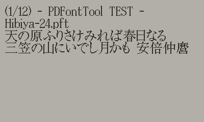

# PDFontTool

PDFontTool is a Command-Line tool for Windows that converts TrueType (.ttf), OpenType (.otf) to fonts (.fnt + png) for [Playdate](https://play.date/).

[日本語](readme-jp.md)

## Folder structure
```
+- pdft
|   +- bin  # PDFontTool Execute file (pdft.exe)
|   |
|   +- src  # PDFontTool Source code
|
+- .vscode  # Batch files for Visual Studio Code
|
+- Source   # Test application for Playdate (PDFontTool.pdx) Source code
```

## Usage
```
pdft [OPTIONS]... [SOURCE] [OUTPUT FOLDER] [OUTPUT FILENAME] [FONT SIZE]
```

### SOURCE
Source font file path.

### OUTPUT FOLDER
Output folder path.

### OUTPUT FILENAME
Output filename (without file extension).

### FONT SIZE
Output font size (pixel).

### OPTIONS

#### -R
Enable recalc character width. (Recalculation may takes longer.)

#### -ma
Margin for ASCII range (Must be specified with '-R')

#### -mo
Margin for outside ASCII range (Must be specified with '-R')

## -R Option
- Since many of the Kanji bitmap fonts created in the past were monospaced fonts and did not look good, especially in the ASCII range, PDFontTool has implemented an option to measure and reflect the actual font width to improve the appearance.
- Because GDI+'s GetPixel is used to measure character width, execution time is considerably longer.

## PDFontTool.pdx
PDFontTool.pdx is a test application for Playdate to check fonts generated by pdft.exe.
Visual Studio Code is used to build and run the application.
## TODO
- Kerning pair support.

## Example


## Translation
The original documentation created by the author is in Japanese. English documentation is either based on machine translation or has not been created. If you would like to help us, we would appreciate it if you could create English documentation and point out any errors.

## In addition
- Because pdft.exe relies heavily on Windows OS features, it is difficult to make it work on other platforms.
- Playdate is © Panic Inc. PDFontTool is not an official Panic Inc. tool.
- We assumes no responsibility for any damage caused by the use of PDFontTool.


