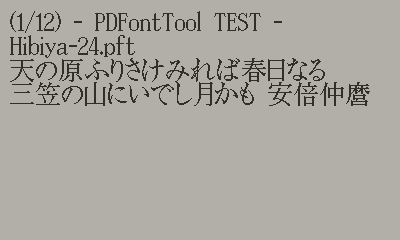
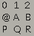

# PDFontTool

PDFontTool is a command line tool for Windows (10 or later) that converts Windows-supported fonts such as TrueType Font(.ttf), OpenType Fontt(.otf), etc. into fonts for [Playdate](https://play.date/) (.fnt + .png).

It is rendered directly on a black and white canvas without anti-aliasing using Windows Direct2D. Outline fonts can also be converted to reasonably clean fonts without requiring detailed settings.

[日本語](Readme-jp.md)

## Conversion Sample



|NotoSansJP-Thin 16px|NotoSansJP-Thin 24px|NotoSansJP-Medium 24px|
|---|---|---|
||||

|Lato-Thin 16px|Lato-Regular 24px|Lato-BoldItalic 24px|
|---|---|---|
||||

## Folder structure

```text
+- pdft
|   +- bin  # PDFontTool Execute file (pdft.exe)
|   |
|   +- src  # PDFontTool Source code
|
+- .vscode  # Batch files for Visual Studio Code
|
+- Source   # Test application for Playdate (PDFontTool.pdx) Source code
```

## Usage

```bat
pdft [OPTIONS]... [SOURCE] [OUTPUT FOLDER] [OUTPUT FILENAME] [FONT SIZE]
```

### SOURCE

Source font file path.

### OUTPUT FOLDER

Output folder path.

### OUTPUT FILENAME

Output filename (without file extension).

### FONT SIZE

Output font size (pixel).

### OPTIONS

#### -g

Specify the grid size (the size of one glyph in the generated PNG image) in width,height.

- If not specified, it is automatically calculated from the font rendering size.

#### -R

Enable recalc character width.
**(This option is not necessary for other than monospace fonts. Normally, this option should not be specified.)**

- Since many of the Kanji bitmap fonts created in the past were monospaced fonts and did not look good, especially in the ASCII range, PDFontTool has implemented an option to measure and reflect the actual font width to improve the appearance.
- Because GDI+'s GetPixel is used to measure character width, execution time is considerably longer.

#### -ma

Margin for ASCII range

- Must be specified with '-R'

#### -mo

Margin for outside ASCII range

- Must be specified with '-R'

## PDFontTool.pdx

PDFontTool.pdx is a test application for Playdate to check fonts generated by pdft.exe.
Visual Studio Code is used to build and run the application.

## Translation

The original documentation created by the author is in Japanese. English documentation is either based on machine translation or has not been created. If you would like to help us, we would appreciate it if you could create English documentation and point out any errors.

## In addition

- Because pdft.exe relies heavily on Windows OS features, it is difficult to make it work on other platforms.
- Playdate is © Panic Inc. PDFontTool is not an official Panic Inc. tool.
- We assumes no responsibility for any damage caused by the use of PDFontTool.
